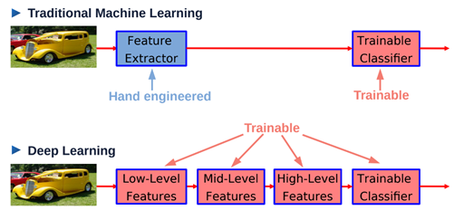
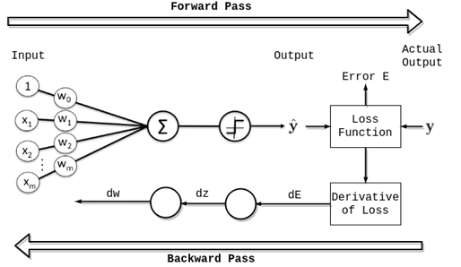
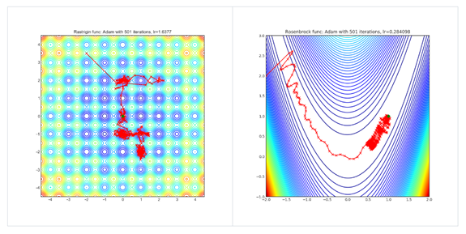
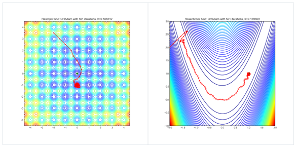

# Neural Networks

Summary: This project is an introduction to neural networks.

💡 [Tap here](https://new.oprosso.net/p/4cb31ec3f47a4596bc758ea1861fb624) **to leave your feedback on the project**. It's anonymous and will help our team make your educational experience better. We recommend completing the survey immediately after the project.

## Contents

1. [Chapter I. Preamble](#chapter-i-preamble) \
    1.1. [Introduction](#chapter-ii-introduction)
2. [Chapter II. Introduction](#chapter-ii-introduction) \
    2.1. [Feed Forward Neural Networks](#feed-forward-neural-networks) \
    2.2. [Universal Approximation Theorem](#universal-approximation-theorem) \
    2.3. [Backpropogation algorithm](#backpropagation-algorithm) \
    2.4. [Variants of SGD](#variants-of-sgd) \
    2.5. [Putting all together](#putting-it-all-together)
3. [Chapter III. Goal](#chapter-iii-goal)
4. [Chapter IV. Instructions](#chapter-iv-instructions)
5. [Chapter V. Task](#chapter-v-task)
6. [Chapter VI. Bonus part](#chapter-vi-bonus-part)

## Chapter I. Preamble

We have already discussed linear, tree-based, and other models for supervised problems. Linear models make a strong assumption that the input-output mapping is linear; this class of models is interpretable, but generally has low accuracy.

One way to get a more accurate model is to switch to tree-based models, which partition the input space into regions, leading to the ability to solve nonlinear problems. Another way has been shown in previous chapters: we extend the feature set with nonlinear features such as products, fractions, polynoms, trigonometric or logarithmic variations of the original features. This process requires manual creation and selection of features, which is very limiting.

**Neural networks** and **deep learning** in general provide us with flexible models that automate the feature creation process and allow us to work with sophisticated non-linear problems.

## Chapter II. Introduction

### Feed Forward Neural Networks

Let’s refresh the definition of the Logistic Regression model.
Logistic Regression is model of the following form:

$$p(y=i|\mathbf{x}, \boldsymbol{\theta}) = \sigma (a) = \frac{1}{1 + e^{-a}}, \text{where } a = \mathbf{w}^T \mathbf{x} + b \text{ and }  \boldsymbol{\theta} = (\mathbf{w}, b)$$

The function $`\boldsymbol \sigma`$ is called **sigmoid**. Logistic Regression is equivalent to linear combination of features of the matrix $`\boldsymbol X`$ and adding a bias term **b**. Linear combination of features with sigmoid nonlinearity can be considered as an implicit feature generation process.
Overlaying another Logistic Regression classifier on the new feature space allows to model more complex functions:

$$p(y|\mathbf{x}, \boldsymbol{\theta}) = \text{Ber}(y|\sigma(\mathbf{a}_3))$$
$$\mathbf{a}_3 = \mathbf{w}_3^T \mathbf{z}_2 + b_3$$
$$\mathbf{z}_2 = \varphi(\mathbf{W}_2 \mathbf{z}_1 + b_2)$$
$$\mathbf{z}_1 = \varphi(\mathbf{W}_1 \mathbf{x} + b_1)$$


[Source](https://probml.github.io/pml-book/book1.html)

where Ber is [Bernoulli distribution](https://en.wikipedia.org/wiki/Bernoulli_distribution).

Imagine that we have a way to learn all trainable (matrices **W** and biases **b**) parameters simultaneously. This model is known as a **feedforward neural network (FFNN)** or **multilayer perceptron (MLP)**. The second layer of the network trains the classifier, and the first layer learns a feature transformation that helps the classifier "separate" classes in a new, "customized" feature space. We can stack more than 2 layers to get more powerful features at the end. In addition, the sigmoid function can be replaced by another non-linear function. Non-linear functions are called **activation functions** in this context. Layers between the input and output layers are called **hidden layers**. In the figure below, $`z_1`$ and $`z_2`$ are hidden layers.

Schematically, the differences between neural and "non-neural" supervised learning are illustrated in the following figure: each successive layer transforms the input into more and more sophisticated features that are better suited for solving the original supervised problem. At the end we see a trainable classifier module (model similar to Logistic Regression).



[Source](https://drive.google.com/file/d/1Q7LtZyIS1f3TfeTGll3aDtWygh3GAfCb/view)

Neural networks have been shown to be most effective in domains with non-tabular (sometimes called unstructured) data because of their compositional nature. For example, in computer vision problems, features on different layers can be edges, corners, object parts, etc. (see the following images).


[Source](https://drive.google.com/file/d/1Q7LtZyIS1f3TfeTGll3aDtWygh3GAfCb/view)

We say (according to [Yann LeCun](https://drive.google.com/file/d/1Q7LtZyIS1f3TfeTGll3aDtWygh3GAfCb/view)) that the model is a **deep learning model** if it is a neural network and contains more than 1 hidden layer. Linear models, KNN, Naive Bayes don't have a feature hierarchy; CART is not considered deep because it operates in the original feature space; and only SVMs can be considered a special case of MLP with 1 [hidden layer](https://www.deeplearningbook.org/contents/optimization.html).

MLP networks aren't the only neural network architecture, but they are basic building blocks for more sophisticated neural network models.

### Universal Approximation Theorem

Geometrically, linear transformations (matrix multiplication and bias term addition) can move, reflect, and scale inputs in space; nonlinear functions "squash" inputs. These two types of transformations give the possibility (in theory) to model any arbitrary complex function. It is a mathematically proven result called the **Cybenko Theorem** (or **Universal Approximation Theorem**). [Source](https://en.wikipedia.org/wiki/Universal_approximation_theorem):

> MLP with 1 or more hidden layers and sigmoid activation functions is capable of accurately representing any continuous function (it can model any continuous function, given enough hidden units, to any desired level of accuracy).

Additional results have been proved following the Cybenko Theorem: any differentiable nonlinear nonpolynomial activation can be used in MLP to produce a Universal approximator. One of the most popular choices is the **rectified linear unit**:

```math
\text{ReLU}(\boldsymbol{x}) = \max(0, \boldsymbol{x})
```

Unfortunately, Cybenko Theorem doesn't show how to learn optimal parameters (weights) for MLP layers. In addition, for good accuracy we sometimes need a very "wide" hidden layer: the number of needed parameters can be exponential of the size of the input.
These facts show that using MLP with more than 1 hidden layer is justified. We can think of it as a decomposition of an extremely wide hidden layer into a sequence of smaller layers that build a "hierarchy" of features.

### Backpropagation Algorithm

Neural networks are very flexible because of their compositionality. We need to find a training algorithm that allows us to train all the layers at the same time.
Surprisingly, algorithms for training neural networks are similar to learning procedures for linear models.

Applying MLP to some input means a chain of computations: we use the first hidden layer and the nonlinearity to compute the input for the second hidden layer, then we use the output of the second layer after the nonlinearity as the input for the third layer, and so on. This process is called **forward propagation**.

If we use differentiable activation functions at each layer, we can compute the gradient of the loss function with respect to any parameter of the network. The gradient is computed backwards:

1. Calculate the loss gradient with respect to the output layer parameters.
2. Calculate gradient of output layer's parameters with respect to (w.r.t.) previous layers' parameters.
3. Using the results of 1 and 2, apply the chain rule theorem* and calculate the gradient of the loss w.r.t. the parameters of the previous (for the output) layer.
4. Traversing from the end of the network to the beginning, we compute successively partial derivatives of the loss function w.r.t. to each parameter of the model.

This algorithm is called **backpropagation**. Computing gradients in the general form requires **matrix differentiation**, but the concept remains the same.



[Source](https://www.baeldung.com/cs/deep-learning-bias-backpropagation)

Having a gradient of loss with respect to each learnable parameter allows to apply the standard SGD (Stochastic Gradient Descent) procedure to train the network. In essence, training a neural network is similar to training linear models: the gradient computation is just more complicated. Backpropagation is clearly described [here](https://en.wikipedia.org/wiki/Backpropagation) and [here](https://www.baeldung.com/cs/deep-learning-bias-backpropagation).

Training neural networks is easy in theory, but complicated in practice. There are several difficulties associated with training:

- Parameter initialization. There are several strategies for random initialization.
- Gradient explosion. Gradients can be too large and mislead our optimization process.
- Gradient saturation. On the other hand, gradients can be too small (due to improper activation functions, bad initialization, etc.) and our optimization process slows down extremely and eventually stops.

[Source](https://d2l.ai/) gives an overview of modern tricks and tips for training deep networks.

### Variants of SGD

Loss functions in neural networks depend on thousands and millions of parameters, making the loss surface highly non-convex. Sometimes the SGD algorithm is not sufficient to obtain good quality because of the existence of local minima or saddle points in the loss surface. There are several tricks to improve vanilla SGD, but the most basic are

- Momentum: accumulate an exponentially decaying moving average of the partial gradients.
- Adaptive learning rate: different learning rates for different parameters, we go fast in some directions and slow in others, based on the amplitude of the gradient.

SGD and its variants are called **optimizers** in the context of optimizing neural networks.
The [Adam algorithm](https://www.deeplearningbook.org/contents/optimization.html) is considered the best out-of-the-box choice.
The following pictures show the performance of the **SGD** algorithm, [**Adam** and **QHAdam**](https://arxiv.org/abs/1810.06801) on the optimization of 2 sophisticated functions (details are [here](https://github.com/jettify/pytorch-optimizer)).

SGD  


Adam  


We see that SGD failed in both cases; Adam has success but with difficulties and a very noisy path.

QHAdam  


QHAdam is a modification of the original Adam method. It can be seen that it failed in the first case, but performed very well in the second, with a nice smooth path to the global minima.

From these examples we can see that optimizers can perform differently in different situations and problems.

### Putting it all together

Neural networks reduce the amount of feature engineering done by humans, but replace some of that time with network engineering: the process of designing and training neural networks. We need to choose the right number of layers, activation functions, optimizers, etc.

[This resource](http://playground.tensorflow.org/) gives a playground simulator on network engineering for solving nonlinear classification problems.

[This](http://d2l.ai/) gives a detailed overview of neural networks and deep learning in general.

## Chapter III. Goal

The goal of this task is to get a deep understanding of the basics of neural networks.

## Chapter IV. Instructions

- This project will be evaluated by humans only. You are free to organize and name your files as you wish.
- We use Python 3 as the only correct version of Python.
- For training deep learning algorithms you can try Google Colab. It offers free kernels (Runtime) with GPU, which is faster than CPU for such tasks.
- The standard is not applied to this project. However, you are asked to be clear and structured in your source code design.
- Place the datasets in the data subfolder.

## Chapter V. Task

1. Download the data from the [Don'tGetKicked contest](https://www.kaggle.com/c/DontGetKicked).

    Design a train/validation/test split.

    Use the "PurchDate" field for the split, test must be later in time than validation, same goes for validation and train: train.PurchDate < valid.PurchDate < test.PurchDate.
    Use the first 33% of the dates for the train, the last 33% of the dates for the test, and the middle 33% for the validation set. *Don't use the test dataset until the end!*

    Use sklearn's LabelEncoder or OneHotEncoder to preprocess categorical variables. Be careful with data leakage (fit Encoder to train and apply to validation & test). Consider another coding approach if you encounter new categorical values in validation & test (not seen in training). [Example](https://contrib.scikit-learn.org/category_encoders/count.html)
2. Create a Python class, MLP with 1 hidden layer and sigmoid activation function at the end of the network.
It should support *fit, predict_proba* and *predict methods*. Also, the number of neurons in the hidden layer and the activation function must be parameters of your class.

    Here is the blueprint:

    ```python
    model = MLP(n_hidden=100, activation=np.arctan)
    model.fit(Xtrain, ytrain)
    model.predict_proba(Xvalid)
    ```

    - Initialize the network with small random numbers.
    - Use Log Loss (Binary Cross Entropy) as the loss function.
    - Implement a forward pass; you can use a fixed batch size like 32, forward pass maps arrays of shape (batch_size, number_of_features) to arrays of shape (batch_size, 2) where 2 means dimensions of [probability_of_0, probability_of_1] output space.
    - Write down the gradients of the loss function with respect to the parameters of the net. Use [4](https://en.wikipedia.org/wiki/Backpropagation), [9](http://d2l.ai/) as a guide for deriving gradients.
    - Use gradients to perform Backprop. Implement Backprop.
    - Implement SGD algorithm to tune model parameters.
    - Design a basic train-validation loop: iterate over the training dataset, batch by batch, update the parameters of the network, and check the quality of the model using the validation set.
    - Write code to update network weights using SGD or Adam.
3. With your MLP module and careful network engineering, you must obtain at least a 0.15 Gini score on the validation dataset. You can train for more than 1 epoch, use different activation functions, and different optimizers (like SGD or Adam).
4. Use sklearn's MLPClassifier and check its performance on the validation dataset. Is it better than your module? If so, why?
5. Implement and try different activation functions: sigmoid, ReLU, cosine. Remember that you have to derive gradients for each different activation function. Which activation function gives the best performance on the validation dataset?
6. Design an MLP module with 1 hidden layer using any high level deep learning framework: Pytorch, Keras, or Tensorflow. Check its performance on the validation dataset.  Is it better than your module? If so, why?
7. Take the best model and estimate its performance on the test dataset: check the Gini scores on all three datasets for your best model: training Gini, valid Gini, test Gini. Do you see a drop in performance when comparing the valid quality to the test quality? Is your model overfitting or not? Explain.

## Chapter VI. Bonus Part

1. Implement the Adam algorithm to tune the parameters of the model.

Chain rule is explained in [source](https://en.wikipedia.org/wiki/Chain_rule).

Matrix differentiation is cracked in the following [source](http://d2l.ai/chapter_preliminaries/autograd.html).

>Please leave feedback on the project in the [feedback form.](https://forms.yandex.ru/cloud/646b479ac769f12ef19bce19/) 
